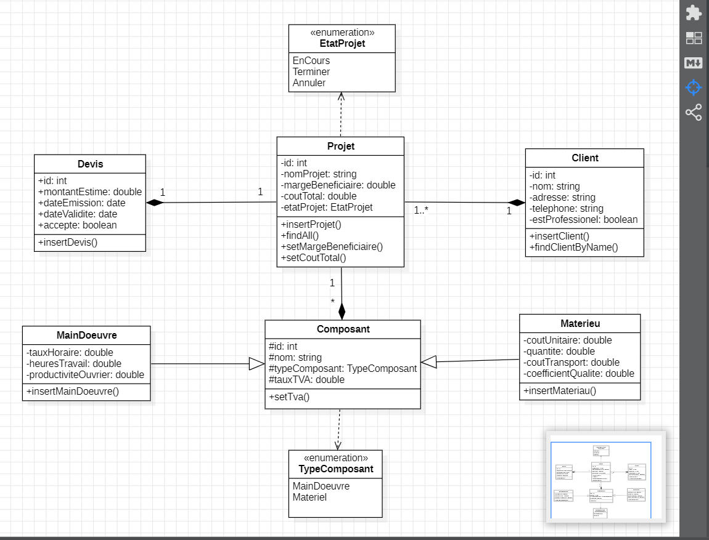

# BatiCuisine

## Vue d'ensemble du projet
**BatiCuisine** est une application Java destinée aux professionnels de la construction et de la rénovation de cuisines. L'application calcule le coût total des projets en prenant en compte les coûts des matériaux et de la main-d'œuvre, avec des fonctionnalités avancées pour la gestion des clients, la génération de devis personnalisés, et une vue financière détaillée des projets de rénovation.

## Fonctionnalités
- **Gestion des projets :**
    - Ajouter des clients associés à un projet.
    - Gérer les matériaux et la main-d'œuvre.
    - Associer des devis aux projets pour estimer les coûts avant les travaux.

- **Gestion des composants :**
    - Matériaux : Suivi des coûts, quantités, transport, TVA, et qualité.
    - Main-d'œuvre : Suivi des taux horaires, heures travaillées, et productivité.

- **Gestion des clients :**
    - Enregistrer des clients avec leur nom, adresse, et numéro de téléphone.
    - Différencier les clients professionnels et particuliers.

- **Génération de devis :**
    - Créer un devis avant le début des travaux, incluant une estimation des matériaux, de la main-d'œuvre, et des taxes.


- **Calcul des coûts :**
    - Intégrer tous les coûts des composants dans le calcul total du projet.
    - Appliquer une marge bénéficiaire pour obtenir le coût final.
    - Tenir compte de la TVA et des remises applicables.


## Installation

### Prérequis
- **Java JDK 11 ou supérieur**
- **PostgreSQL** pour la gestion de la base de données
- **Git** pour le contrôle de version

### Étapes
1. Cloner le dépôt :
   ```bash
   git clone https://github.com/Mohammedaminox/Bati-Cuisine/tree/dev
   ```
2. Compiler et empaqueter le projet :
   ```bash
   javac -d bin src/*.java
   jar cvfe Baticuisine.jar com.batiCuisine.Main -C out/production/Bati-Cuisine .
   ```
3. Configurer la base de données :
    - Créer une base de données PostgreSQL et les tables selon le schéma du projet.
    - Insérer des enregistrements dans chaque table pour les besoins de la démonstration.

4. Exécuter l'application :
   ```bash
   java -cp Baticuisine.jar;lib/postgresql-42.7.4.jar com.batiCuisine.Main
   ```

## Utilisation

1. **Créer un nouveau projet** : Ajouter les détails du projet, comme le client, les matériaux, et la main-d'œuvre.
2. **Calculer les coûts** : Estimer les coûts en fonction des matériaux et de la main-d'œuvre, puis générer un devis.
3. **Afficher les détails** : Visualiser les informations sur les projets, les clients, et les coûts.
4. **Enregistrer les devis** : Sauvegarder et gérer les devis pour chaque projet.

## Spécifications techniques
- **Java Streams & Collections** : Pour une manipulation efficace des données.
- **HashMap & Optional** : Utilisés pour stocker et gérer les composants des projets.
- **Enum** : Pour définir les statuts des projets.
- **PostgreSQL** : Pour la gestion des données et la persistance.
- **Pattern Singleton & Repository** : Utilisés dans l'architecture du projet.
- **API Java Time** : Pour la gestion des dates dans l’application.
- **Génération de JAR** : Le projet peut être empaqueté dans un fichier `BatiCuisine.jar`.

## Exemple d'utilisation

```
=== Menu Principal ===
1. Créer un nouveau projet
2. Afficher les projets existants
3. Quitter
```

## Diagramme de classes


Voici le diagramme de classes représentant la structure de l'application :




